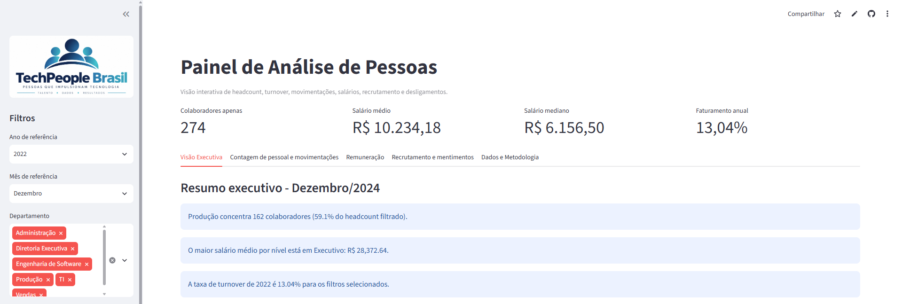
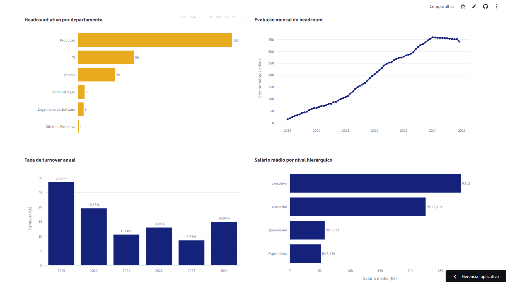

# projeto_streamlit_dash


<p align="center">


</p>


<h1 align="center">

People Analytics Dashboard

</h1>


<p align="center">

Dashboard interativo para análise de indicadores estratégicos de
Recursos Humanos, desenvolvido com Python, pandas, Plotly e Streamlit.

</p>


<p align="center">

<strong>`People Analytics • Data Analytics • Python •
Streamlit`</strong>

</p>


------------------------------------------------------------------------

## Sobre o projeto

Este projeto apresenta uma solução de **People Analytics** construída a
partir de uma base histórica mensal de Recursos Humanos.

O objetivo é transformar dados de colaboradores em informações úteis
para acompanhamento da força de trabalho e apoio à tomada de decisão,
explorando:

-   headcount e evolução do quadro;
-   turnover;
-   admissões e desligamentos;
-   remuneração;
-   distribuição geográfica;
-   matriz x filiais;
-   fontes de recrutamento;
-   desempenho dos colaboradores.

A aplicação foi desenvolvida em **Streamlit**, com visualizações
interativas em **Plotly** e tratamento dos dados com **pandas**.

> **Nota:** TechPeople Brasil é a organização utilizada no contexto do
> estudo de caso. O projeto possui finalidade educacional e de
> portfólio.

------------------------------------------------------------------------

## Dashboard

### Visão Executiva


<p align="center">




</p>

A visão executiva concentra os principais indicadores e permite uma
leitura rápida da situação do quadro de colaboradores.

### Headcount e movimentações


<p align="center">


</p>
```
Permite acompanhar a evolução da força de trabalho, admissões,
desligamentos e distribuição dos colaboradores.

### Remuneração

```{=html}
<p align="center">
```
``{=html}
```{=html}
</p>
```
Permite comparar salários entre níveis, departamentos e tipos de
unidade, além de observar a distribuição salarial.

> Salve os screenshots na pasta `assets/` utilizando exatamente os nomes
> indicados acima para que apareçam automaticamente no GitHub.

------------------------------------------------------------------------

## Principais resultados

Na fotografia de **dezembro de 2024**, foram identificados **341
colaboradores ativos**.

  Departamento               Headcount
  ------------------------ -----------
  Produção                         199
  TI                                71
  Vendas                            48
  Engenharia de Software            12
  Administração                     10
  Diretoria Executiva                1
  **Total**                    **341**

A taxa de turnover calculada para **2024** foi de aproximadamente
**14,98%**, considerando desligamentos distintos no ano em relação ao
headcount médio mensal.

------------------------------------------------------------------------

## Problema de negócio

O dashboard busca responder perguntas como:

-   Quantos colaboradores estavam ativos em determinado período?
-   Quais departamentos concentram o maior headcount?
-   Como o quadro evoluiu ao longo do tempo?
-   Qual é a taxa de turnover?
-   Onde estão concentrados os desligamentos?
-   Como a remuneração varia entre níveis e departamentos?
-   Existem diferenças de média salarial entre matriz e filiais?
-   Quais fontes de recrutamento apresentam melhor desempenho agregado?

------------------------------------------------------------------------

## Regras de negócio

### Headcount ativo

A base possui granularidade mensal: um mesmo funcionário aparece em
vários períodos. Por isso, headcount não é a simples contagem de linhas.

Um colaborador é considerado ativo no fechamento quando:

``` text
Data de admissão <= último dia do mês
E
(Data de desligamento está vazia OU Data de desligamento > último dia do mês)
```

Implementação:

``` python
df["Ativo_Fim_Mes"] = (
    (df["Data_Admissao"] <= df["Fim_Mes"])
    &
    (
        df["Data_Desligamento"].isna()
        |
        (df["Data_Desligamento"] > df["Fim_Mes"])
    )
)
```

### Turnover anual

``` text
Turnover =
Funcionários distintos desligados no ano
÷
Headcount médio mensal do ano
× 100
```

A regra fica centralizada em `metrics.py`.

------------------------------------------------------------------------

## Arquitetura

``` text
Base Excel
    │
    ▼
  app.py
Carga • Tratamento • Filtros • Interface
    │
    ├──────────────► metrics.py
    │                KPIs • Agregações • Regras de negócio
    │
    └──────────────► charts.py
                     Visualizações Plotly
    │
    ▼
Dashboard Streamlit
```

### `app.py`

Responsável por leitura e tratamento inicial, filtros, organização das
abas, KPIs e integração da aplicação.

### `metrics.py`

Centraliza headcount, salários, turnover, movimentações, agregações e
demais regras analíticas.

### `charts.py`

Centraliza gráficos Plotly, títulos, rótulos e formatação visual.

Essa separação evita misturar **interface**, **regra de negócio** e
**visualização**.

------------------------------------------------------------------------

## Estrutura de pastas

``` text
people_analytics/
│
├── README.md
├── app.py
├── metrics.py
├── charts.py
│
├── assets/
│   ├── logo_techpeople.png
│   ├── dashboard_executivo.png
│   ├── dashboard_headcount.png
│   └── dashboard_remuneracao.png
│
└── data/
    └── Base_People_Analytics.xlsx
```

------------------------------------------------------------------------

## Tecnologias

  Tecnologia   Aplicação
  ------------ ----------------------------
  Python       Linguagem principal
  pandas       Tratamento e transformação
  Plotly       Visualizações interativas
  Streamlit    Aplicação web analítica
  Excel        Fonte de dados do estudo
  Pathlib      Caminhos e arquivos

------------------------------------------------------------------------

## Funcionalidades

-   filtros interativos;
-   KPIs executivos;
-   headcount por departamento, estado e unidade;
-   evolução histórica do headcount;
-   turnover anual;
-   admissões x desligamentos;
-   saldo de movimentações;
-   salário médio por nível e departamento;
-   matriz x filiais;
-   distribuição salarial;
-   motivos de desligamento;
-   desligamentos por departamento;
-   desempenho por fonte de recrutamento;
-   insights executivos.

------------------------------------------------------------------------

## Como executar

### 1. Clone o repositório

``` bash
git clone <URL-DO-SEU-REPOSITORIO>
cd people_analytics
```

### 2. Crie o ambiente virtual

``` bash
python -m venv .venv
```

Windows:

``` bash
.venv\Scripts\activate
```

Linux/macOS:

``` bash
source .venv/bin/activate
```

### 3. Instale as dependências

``` bash
pip install streamlit pandas plotly openpyxl
```

Ou utilize um `requirements.txt`:

``` text
streamlit
pandas
plotly
openpyxl
```

``` bash
pip install -r requirements.txt
```

### 4. Execute

``` bash
streamlit run app.py
```

Por padrão, a aplicação local fica disponível em
`http://localhost:8501`.

------------------------------------------------------------------------

## Fluxo analítico

``` text
Dados brutos
    ↓
Leitura com pandas
    ↓
Tratamento
    ↓
Regras de negócio
    ↓
Filtros
    ↓
Métricas
    ↓
Plotly
    ↓
Streamlit
    ↓
Insights para RH
```

------------------------------------------------------------------------

## Boas práticas aplicadas

-   separação entre interface, métricas e visualizações;
-   funções reutilizáveis;
-   regras de negócio centralizadas;
-   `nunique()` para funcionários distintos;
-   tratamento explícito de datas;
-   valores salariais mantidos como numéricos;
-   formatação monetária apenas na apresentação;
-   cache para reduzir leituras repetidas;
-   caminhos relativos com `Path`;
-   chaves únicas para gráficos reutilizados no Streamlit.

------------------------------------------------------------------------

## Cuidados na interpretação

Diferenças de salário médio entre matriz e filiais não representam
automaticamente desigualdade salarial. A composição de cargos, níveis,
departamentos e localidades pode explicar parte da diferença.

Da mesma forma, desempenho agregado por fonte de recrutamento deve ser
interpretado como análise exploratória, e não como evidência de
causalidade.

------------------------------------------------------------------------

## Próximas evoluções

-   conexão com SQL Server ou Databricks;
-   Parquet ou Lakehouse como camada de dados;
-   autenticação e controle de acesso;
-   indicadores de tempo de empresa e retenção;
-   turnover voluntário x involuntário;
-   testes automatizados das métricas;
-   previsão de turnover;
-   deploy em cloud;
-   atualização automatizada dos dados.

Arquitetura futura:

``` text
Sistema de RH
      ↓
Pipeline de dados
      ↓
SQL / Data Lake / Databricks
      ↓
Camada curada de People Analytics
      ↓
Streamlit
      ↓
RH e Liderança
```

------------------------------------------------------------------------

## Aprendizados

O projeto permitiu praticar:

-   análise da granularidade;
-   definição de regras de negócio;
-   snapshots mensais;
-   transformação com pandas;
-   construção de KPIs;
-   Plotly;
-   organização modular em Python;
-   Streamlit;
-   tradução de análises técnicas em informações de negócio.

------------------------------------------------------------------------

## Autor

Projeto desenvolvido como estudo prático e portfólio de **Data Analytics
/ People Analytics**.

Personalize antes da publicação:

``` text
Nome: Jurandir Juvino
LinkedIn: linkedin.com/in/jurandir-filho-ba1b0b57
GitHub: https://github.com/JurandirFilho
```

------------------------------------------------------------------------

## Observação sobre os dados

Antes de publicar uma base de RH em um repositório público, confirme se
os dados são fictícios, anonimizados ou possuem autorização adequada.
Informações pessoais ou corporativas confidenciais não devem ser
disponibilizadas publicamente.

------------------------------------------------------------------------

```{=html}
<p align="center">
```
`<strong>`{=html}People Analytics`</strong>`{=html}`<br>`{=html}
Transformando dados de pessoas em informações para decisão.
```{=html}
</p>
```
